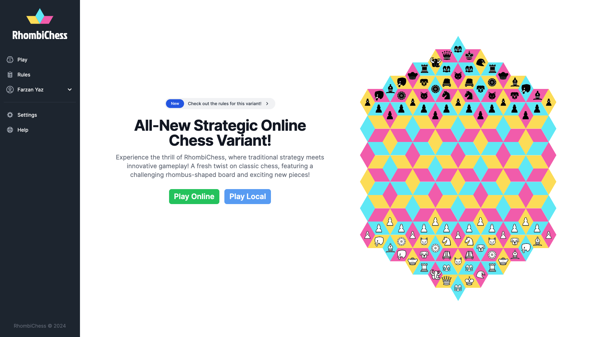

# RhombiChess

Chess has a rich history tracing back to the 6th century, and today it's played worldwide. As
students intrigued by the game of chess, we were very eager to learn more about a chess variant
with fresh new board rules, new pieces, and even a new board type. This is a project worth doing
as this variant can bring a fresh challenge to a traditional game, promoting a “what if” mindset to
the classic game and ruleset. To see this new variant succeed, we plan to build a platform where
the game can be played between two people and can have its settings easily changed to offer a
unique experience every match. Making this variant stand out can promote a sense of community
which enables people to form new connections.


The purpose of this application is to introduce a chess variant that has special rules and pieces
which could be challenging for even some chess enthusiasts as it forces the player to see the
chessboard from various angles. It is significantly different from a traditional chessboard in that it
is a variant chessboard that is made up of rhombuses instead of squares (refer to the image on the). This chess variant is intended to encourage the growth of the players’ problem-solving
skills as well as their overall chess skills. It could also be a platform for social interactions as we
intend to host this game online.

## Table of Contents
- [Landing Page](#landing-page)
- [Game UI](#game-ui)
- [Team Members](#team-members)
- [Setting up your environment](#setting-up-your-environment)
  - [Running the application](#running-the-application)
  - [Backend](#backend)
  - [Frontend](#frontend)
  - [Environment Variables](#environment-variables)
- [Testing](#testing)
  - [Backend](#backend-1)
  - [Frontend](#frontend-1)
  - [Cleanup](#cleanup)
- [Containerization](#containerization)
  - [Environment Variables](#environment-variables-1)
  - [Running the containers](#running-the-containers)
## Landing Page
<div align="center" width="full">
  
</div>

## Game UI
<div align="center" width="full">
  
</div>

## Team Members
#### Frontend Developers
- Monica Bazina-Grolinger
- Farzan Yazdanjou
#### Backend Develoeprs
- Anant Prakash
- Nida Nasir
- Philip Lee

## Setting up your environment
### Running the application
If you'd just like to run the application to try our chess variant, you can do so by running the following command from the root directory:
> This command will install all dependencies and start the backend and frontend servers. This includes node, node_modules, and python dependencies. It may take a few minutes to complete.

> If you'd like to make development changes, please follow the instructions below to set up the backend and frontend separately and run them with debugging enabled.
```bash
make start
```
This will start both the backend and frontend servers. To view the application, navigate to `localhost:3000` in your browser.

To stop the application, simply run the following command:
```bash
make stop
```

### Backend
The backend for this project is based on flask, and primarily uses python. To get started on development, we reccomend you use a virtual environment for python to ensure there are no issues with dependencies. We require that you have `Python 3` and `Pip` installed. Run the follwing command to get started:
```bash
make setup-backend
source src/backend/venv/bin/activate
```
This will switch you to the virtual environment, and install all the required dependencies. To exit the virtual environment, simply run `deactivate`.

To start the backend, run the following command:
```bash
python3 src/server/server.py --debug
```

This will start the backend on port 8080 in debug mode. you can now make requests to the backend server. You can test the backend by curling the endpoints, or by using the frontend.


> If you wish to run the backend server outside of a virtual environment, navigate to `/src/server` and install the dependencies using `pip install -r requirements.txt`. From there, you can start the server using `python3 server.py --debug`.

### Frontend
We use NextJS on the frontend for this project. To get started, you will need to have `npm` installed. To install all the required dependencies, run the following command:
```bash
make setup-frontend
```
or navigate to `/src/client` and run `npm install`.

To start the frontend, run the following command within the `/src/client` directory:
```bash
npm run dev
```
This will start the frontend on port 3000. To view the frontend, navigate to `localhost:3000` in your browser.

> Note: The frontend makes various calls to the backend endpoints, even on the landing page. As such, the application requires the backend server to be running. Otherwise, the application will throw errors on load.

### Environment Variables
The front-end requires a few environment variables to function. In a real-world setting, these variables would be distributed in a more secure manner - however, these are not too sensitive and can be re-generated if needed. Navigate to `/src/client/.env` (or create the file if it doesn't exist) and paste in the following:

```
NEXTAUTH_SECRET=3c1af333b04c584f2b9c4f0718fa6ad7
NEXTAUTH_URL=http://localhost:3000

DATABASE_URL="postgres://***REMOVED***/neondb"
SHADOW_DATABASE_URL="postgres://***REMOVED***/shadow"
```

## Testing

### Backend
To run the tests for the backend (`/src/server`), run the following commands:
```bash
cd src/server
python3 -m pytest tests
```
> You need to be in the server directory to run the tests as the tests are relative to the server directory.

For stress tests, run the following command:
```bash
python3 -m locust -f src/server/tests/locustfile.py
```

This will start a locust server on `localhost:8089`. To view the locust server, navigate to `localhost:8089` in your browser.

> You need the backend server running to run the locust tests. You can start the backend server using `python3 server.py --debug`.

Use locust to test the backend by entering the number of users and the spawn rate, then click start.

For hostnames, use `http://localhost:8080` and for the number of users, use `1` or more.

### Frontend
To run the tests for the frontend (`/src/client`), run the following command inside of the client directory:
```bash
npm test
```

### Cleanup
To clean up the project, run the following command from the root directory:
```bash
make clean-all
# or to clean just the backend
make clean-backend
# or to clean just the frontend
make clean-frontend
```

## Containerization
### Environment Variables
The containers need the same environment variables as the local setup. To set these, create a `.env` file in the `/src` directory and paste in the following:
```
NEXTAUTH_SECRET=3c1af333b04c584f2b9c4f0718fa6ad7 
DB_PASSWORD=eN3rZa5OznCd
```
You can replace the values with your own if you'd like. However, if you'd like to change the DB server, you will need to update the `docker-compose` file as well.

### Running the containers
This project contains a `Dockerfile` and a `docker-compose.yml` file to allow for easy containerization. Before running the containers, ensure you have a `.env` file in the `/src` directory. If you do not have one, please refer to the `Environment Variables` section above.

```bash
cd src
docker-compose up
```
This will build the backend and frontend containers, and start them. The backend will be available on port 8080, and the frontend will be available on port 3000.
> Note: This requires you to have a `.env` file in the `/src` directory. If you do not have one, please refer to the `Environment Variables` section above.

To stop the containers, simply run the following command:
```bash
docker-compose down
```
