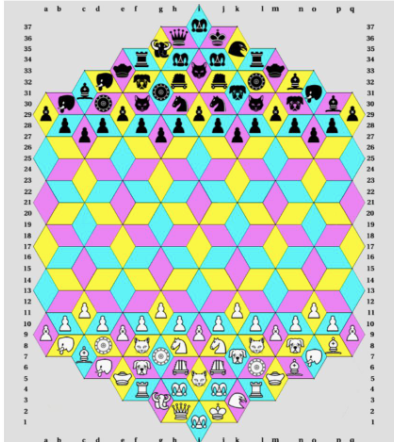

# RHOMBICHESS
<p align="center">
  
</p>
Chess has a rich history tracing back to the 6th century, and today it's played worldwide. As
students intrigued by the game of chess, we were very eager to learn more about a chess variant
with fresh new board rules, new pieces, and even a new board type. This is a project worth doing
as this variant can bring a fresh challenge to a traditional game, promoting a “what if” mindset to
the classic game and ruleset. To see this new variant succeed, we plan to build a platform where
the game can be played between two people and can have its settings easily changed to offer a
unique experience every match. Making this variant stand out can promote a sense of community
which enables people to form new connections.

The purpose of this application is to introduce a chess variant that has special rules and pieces
which could be challenging for even some chess enthusiasts as it forces the player to see the
chessboard from various angles. It is significantly different from a traditional chessboard in that it
is a variant chessboard that is made up of rhombuses instead of squares (refer to the image on the). This chess variant is intended to encourage the growth of the players’ problem-solving
skills as well as their overall chess skills. It could also be a platform for social interactions as we
intend to host this game online.

## Team Members
- Monica Bazina-Grolinger
- Farzan Yazdanjou
- Anant Prakash
- Nida Nasir
- Philip Lee

## Setting up your environment
### Backend
The backend for this project is based on flask, and primarily uses python. To get started on development, we reccomend you use a virtual environment for python to ensure there are no issues with dependencies. We require that you have `Python 3` and `Pip` installed. Run the follwing command to get started:
```bash
make setup-backend
source src/backend/venv/bin/activate
```
This will switch you to the virtual environment, and install all the required dependencies. To exit the virtual environment, simply run `deactivate`.

To start the backend, run the following command:
```bash
python3 src/server/server.py
```

This will start the backend on port 5000. To view the backend, navigate to `localhost:8080` in your browser.

### Frontend
The frontend for this project is based on React. To get started, you will need to have `npm` installed. To install all the required dependencies, run the following command:
```bash
make setup-frontend
```
This will install all the required dependencies. To start the frontend, run the following command:
```bash
npm run dev
```
This will start the frontend on port 3000. To view the frontend, navigate to `localhost:3000` in your browser.


## Testing
### Backend
To run the tests for the backend, run the following command:
```bash
python3 -m pytest src/server/tests -v
```

For stress tests, run the following command:
```bash
python3 -m locust -f src/server/tests/locustfile.py
```

This will start a locust server on `localhost:8089`. To view the locust server, navigate to `localhost:8089` in your browser.

Use locust to test the backend by entering the number of users and the spawn rate, then click start.


### Cleanup
To clean up the project, run the following command:
```bash
make clean-all
# or to clean just the backend
make clean-backend
# or to clean just the frontend
make clean-frontend
```
